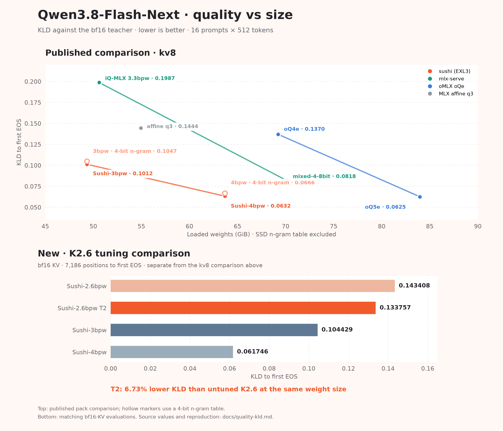

<p align="center"></p>

# SUSHI

A detached fork of [ddalcu's mlx-serve](https://github.com/ddalcu/mlx-serve) that serves a few selected models on Apple
Silicon with custom Sushi quants: EXL3 experts and affine trunks tuned for M5 Pro/Max, still good on M1-M4. Sushi runs
stand-alone and also as a guest engine inside mlx-serve.

## Model support list

* [Qwen3.8-Flash-Next-Sushi-2bpw](https://huggingface.co/beamster/Qwen3.8-Flash-Next-Sushi-2bpw) (requires 48 GB+, or 32 GB [streamed](#streaming-on-a-32-gb-mac))
* [Qwen3.8-Flash-Next-Sushi-2.6bpw](https://huggingface.co/beamster/Qwen3.8-Flash-Next-Sushi-2.6bpw) (requires 64 GB+)
* [Qwen3.8-Flash-Next-Sushi-3bpw](https://huggingface.co/beamster/Qwen3.8-Flash-Next-Sushi-3bpw) (requires 64 GB+)
* [Qwen3.8-Flash-Next-Sushi-4bpw](https://huggingface.co/beamster/Qwen3.8-Flash-Next-Sushi-4bpw) (requires 96 GB+)
* [MiMo-V2.6-Flash-Sushi-2.3bpw](https://huggingface.co/beamster/MiMo-V2.6-Flash-Sushi-2.3bpw) (requires 128 GB, text and image input)
* [GLM-5.3-Flash-Sushi-2.4bpw](https://huggingface.co/beamster/GLM-5.3-Flash-Sushi-2.4bpw) (requires 128 GB, text, image and video input)

## Quality

<p align="center"></p>

MiMo-V2.6-Flash-Sushi-2.3bpw scores KLD 0.0860 (top-1 agreement 91.95%) against the original MOPD checkpoint.

## Install

```bash
brew install beamivalice/tap/sushi
```

Update with `brew upgrade sushi`.

The server listens on `127.0.0.1:12345`. The model's own draft head (MTP for Qwen and MiMo, a DFlash2 assistant for
GLM) and the 8-bit KV cache are on by default.

## Memory

GPU memory in GiB to serve one prompt that fills the whole context (8-bit KV, MTP on, `--mtp-head-kv-quant`). The
prompt cache and the n-gram table stay on the SSD and are not counted.

| context | Sushi-2bpw | Sushi-2.6bpw | Sushi-4bpw | MiMo-2.3bpw |
|---|---:|---:|---:|---:|
| weights only | 35.0 | 44.0 | 63.7 | 83.6 |
| 128k | 40.7 | 49.7 | 69.4 | 87.3 |
| 256k | 43.6 | 52.6 | 72.3 | 89.2 |
| 512k | 48.7 | 57.6 | 77.4 | 92.9 |
| 1M | 58.8 | 67.8 | 87.5 | 100.4 |

A context fits when its number is below the GPU limit you set with `sudo sysctl iogpu.wired_limit_mb`. Max context is
the largest one that fits, at 8-bit / 4-bit KV, with 256 MiB spare and capped at 1M:

| Mac | GPU limit | Sushi-2bpw | Sushi-2.6bpw | Sushi-4bpw | MiMo-2.3bpw |
|---|---|---|---|---|---|
| 48 GB | 43,000 MB (42.0 GiB) | 128k / 192k | — | — | — |
| 64 GB | 59,000 MB (57.6 GiB) | 896k / 1M | 440k / 744k | — | — |
| 96 GB | 88,000 MB (85.9 GiB) | 1M / 1M | 1M / 1M | 880k / 1M | — |
| 128 GB | 120,000 MB (117.2 GiB) | 1M / 1M | 1M / 1M | 1M / 1M | 1M / 1M |

A Mac with less memory than a Sushi pack can still serve it: `--ssd-budget-gb N` keeps N GiB resident and streams
the routed experts from the SSD, with the same replies as a resident load, at a speed set by the SSD. A streamed load
serves text unless `--vision` loads the vision tower, whose weights then come out of the N GiB.

## Streaming on a 32 GB Mac

Sushi-2bpw streams on a 32 GB Mac with MTP on, at about 20 tok/s decode:

```bash
sudo sysctl iogpu.wired_limit_mb=27000
sushi serve --model ~/.sushi/models/Qwen3.8-Flash-Next-Sushi-2bpw --ssd-budget-gb 18 --ctx-size 66000 \
  --expert-pick-tolerance 0.3 --wired-margin-gib 2
```

`--ssd-budget-gb 18` keeps 18 GiB resident (trunk, KV cache and an expert cache) and reads the remaining experts from
the SSD. `--expert-pick-tolerance 0.3` is lossy: when a routed expert is not cached, it uses the best cached expert
whose router probability is at least 0.7 of the missed one's, which saves an SSD read; leave it out for replies
identical to a resident load. `--wired-margin-gib 2` lets the plan come within 2 GiB of the GPU limit (4 by default).
The GPU limit resets at reboot.

## Benchmarks

| Sushi 🍣 1.2.1 | M5 Max | 2k | 4k | 8k | 16k | 32k | 64k | 128k |
|---|---|---:|---:|---:|---:|---:|---:|---:|
| **GLM 5.3 Flash-2.4bpw** | Prefill | 922 | 822 | 809 | 805 | 807 | 756 | 673 |
| | Decode | 48.0 | 46.2 | 46.9 | 45.9 | 45.7 | 47.2 | 45.5 |
| **MiMo V2.6 Flash-2.3bpw** | Prefill | 1,221 | 1,209 | 1,205 | 1,143 | 1,037 | 901 | 712 |
| | Decode | 49.1 | 54.4 | 59.3 | 62.4 | 64.9 | 56.2 | 51.5 |
| **Qwen 3.8 Flash-Next-2.6bpw** | Prefill | 1,932 | 2,116 | 2,180 | 2,165 | 2,149 | 2,123 | 2,003 |
| | Decode | 92.1 | 95.5 | 91.9 | 90.4 | 85.3 | 85.7 | 70.5 |
| **Qwen 3.8 Flash-Next-4bpw** | Prefill | 1,954 | 2,312 | 2,305 | 2,340 | 2,395 | 2,275 | 2,115 |
| | Decode | 78.5 | 89.4 | 84.3 | 86.1 | 82.1 | 81.0 | 73.4* |

Community reports, using llmprobe `--bench-only`:

| Class | Typical RAM | Pack | Prefill tok/s | Gen tok/s |
|---|---|---|---:|---:|
| M1 Max | 64 GB | 3bpw | ~350 | ~32 |
| M2 Max | 64 GB | 3bpw | ~400 | ~38-40 |
| M3 Ultra 60c | 256 GB | 4bpw | ~420 | ~60 |
| M4 Max | 64 GB | 3bpw | ~690 | ~60-65 |
| M5 Pro | 64 GB | 2.6bpw | ~900 | ~50-55 |
| M5 Max | 128 GB | 3bpw | ~1,900 | ~95 |
| M5 Max | 128 GB | 4bpw | ~1,750 | ~90 |
| M5 Max | 128 GB | MiMo 2.3bpw | ~1,130 | ~70 |
| M5 Max | 128 GB | GLM 2.4bpw | ~860 | ~55 |

## Usage

See [recommended launch commands and coding agent usage](docs/usage.md).

## License

MIT, for sushi and the mlx-serve code it forks ([LICENSE](LICENSE)); ported kernels and vendored code are listed in
[NOTICE](NOTICE). The Qwen packs follow the Qwen Community License and the MiMo pack Xiaomi's MIT license, stated on
each Hugging Face page.
